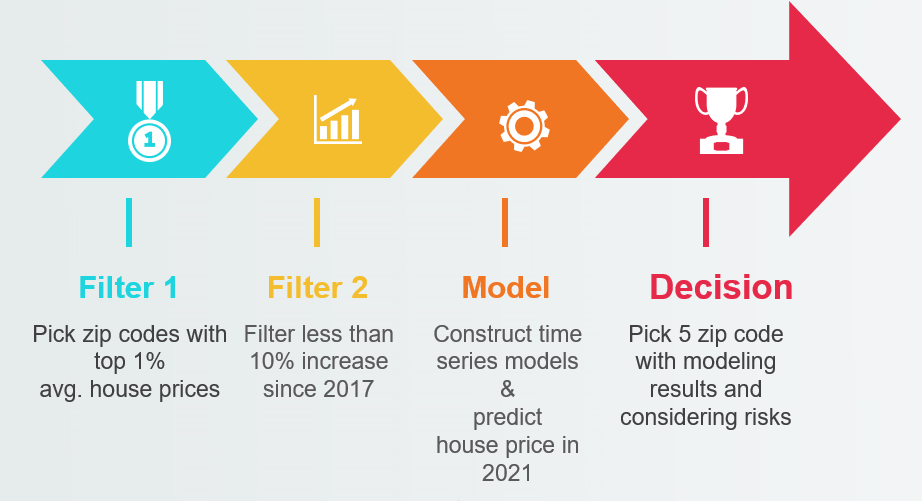
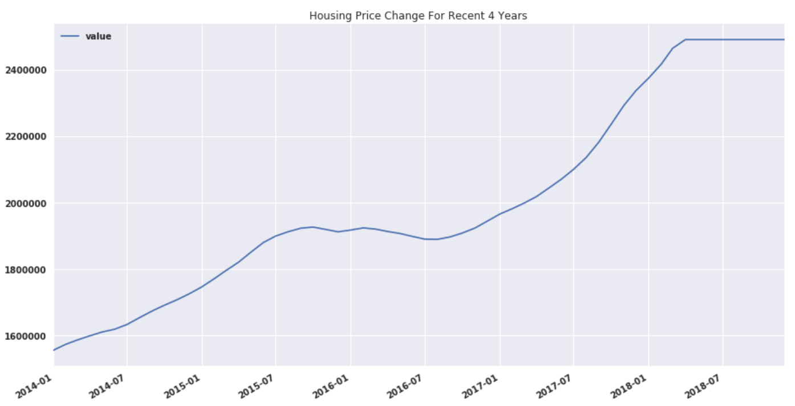
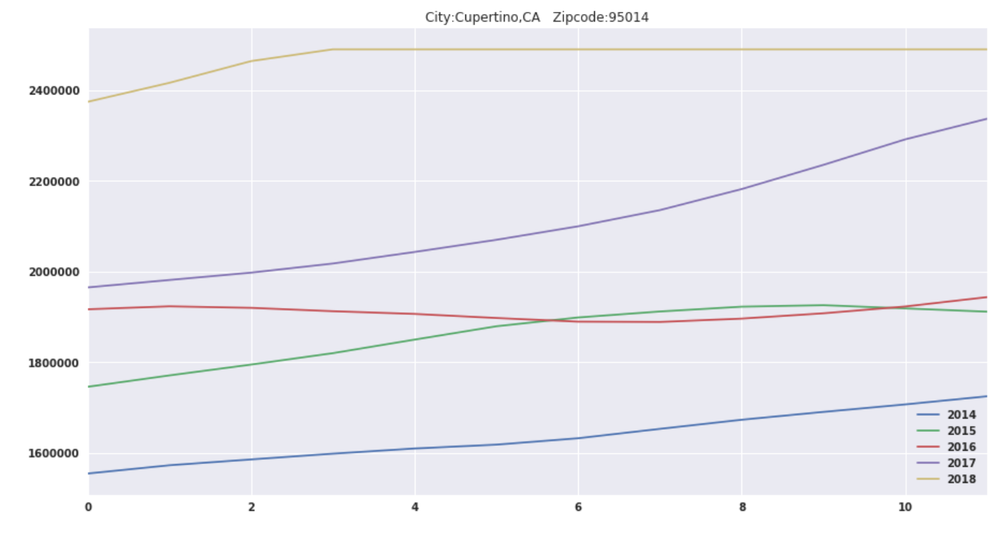
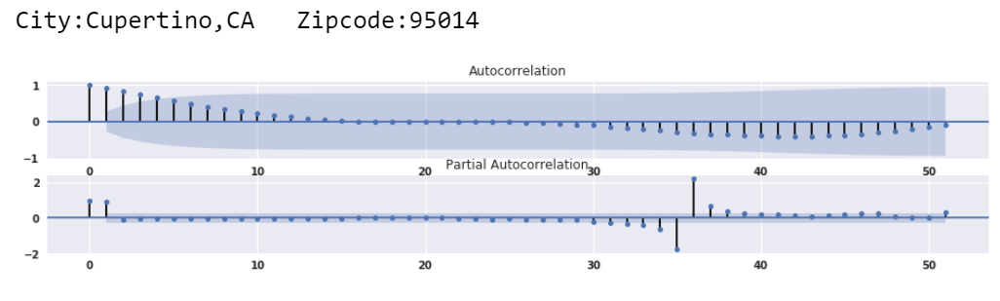
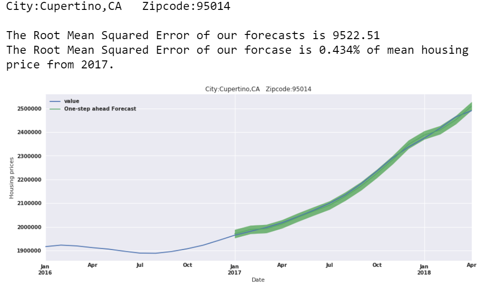
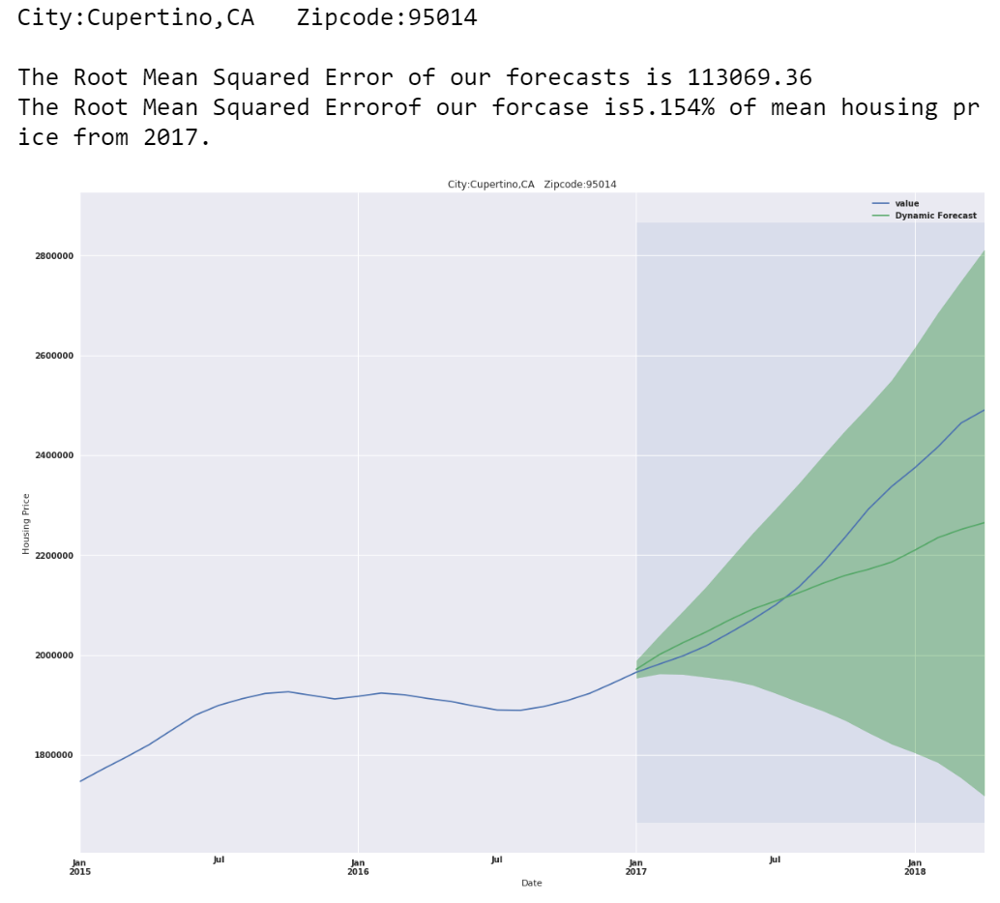
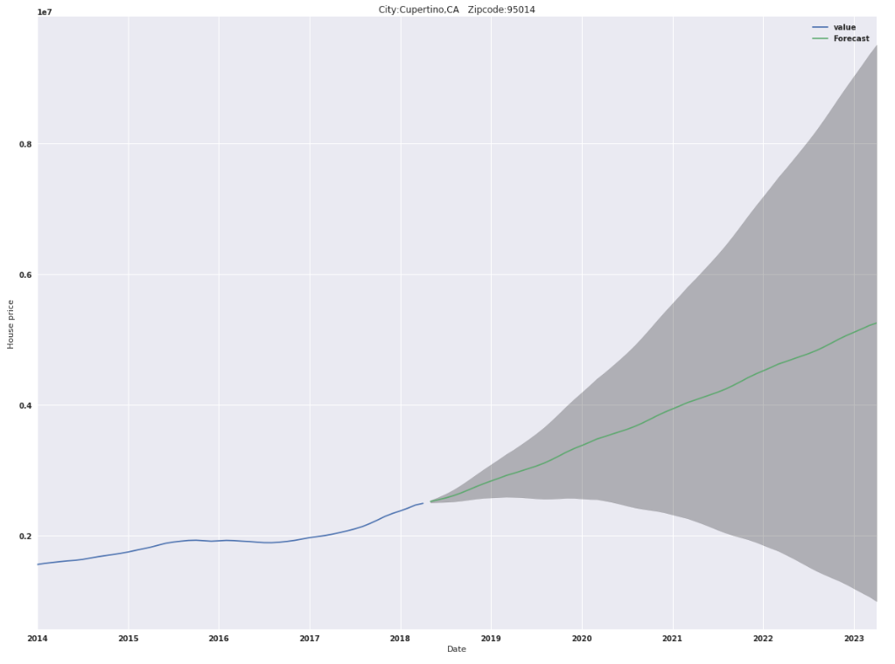
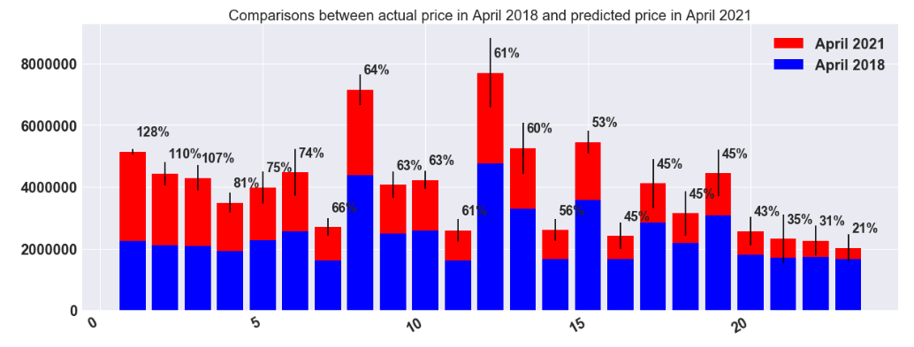
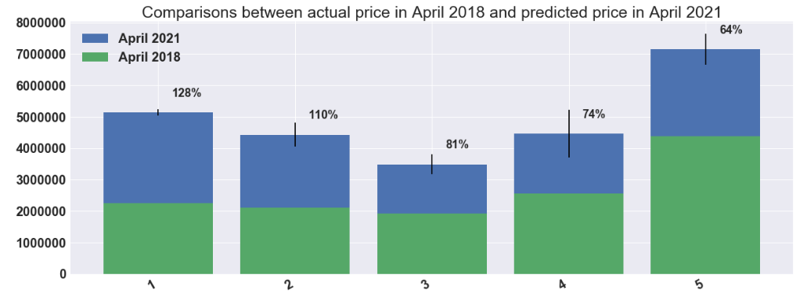

# Housing price prediction using time series modeling

## About the project

#### Goal: Recommend 5 best zip codes to invest in based on the time series of the average housing prices for each zip code

Acting as a consultant for a fictional real-estate investment firm, I interpreted the "best" places for real estate investments as places with less potential investing risks. I used the list of risks in real estate investments from [the article in Mashvisor](https://www.mashvisor.com/blog/major-risks-real-estate-investing/). From the list of 10 major risks of real estate investing, **I focused on the risks for making profit margins and did not consider the revenue making by renting houses** and I reduced the list to the following:

* **Unpredictability of the Real Estate Market**: As in all form of investments, there is no guarantee for making profit in real estate investments. So we will use the time series analysis to build a model to forecast the changes in house prices in future. 

* **Bad Locations**: Location is one of the most important factor. It determines the supply and demand thus the appreciation. 

* **Lack of Liquidity (Ability to access the money within an investment)**: Investment properties are illiquid which means that it cannot be easily converted into cash. Therefore, we have to consider places where housing prices is somewhat stable in the long run. 

* **Depreciation**: This risk can be considered together with unpredictability of the market.

Considering unpredictability and depreciation, the short term investments to focus on realizing profits within a short period of time was appropriate by developments and fix and flips i.e. build new units and sell them or buy existing units, fix and sell them. Moreover, the predictions made a time series model is more accurate when the period from the prediction to the data provided is short i.e. the near future. So, the model would be more useful for the short term investments. 

### About the data
The data (`zillow_data.csv`) was from [Zillow](https://www.zillow.com/research/data/). The given dataset contains the monthly average house price in each zip codes over 51 states from April 1994 to April 2018. 

### Modeling Process

* **Filter 1**: The zip codes whose average house price in 2018 is the 99th percentile or above as it reflects the highest demand and reduce the risk of the bad locations. 

* **Filter 2**: the zip codes with greater than 10 % increase in the average house price from 2017 to 2018 for constructing the time series model. In this step, 23 zip codes are selected. 

* **Time Series Modeling Process**
 1. Data Preprocessing
        * The recent 5 years (January, 2014 ~ April, 2018) of data was used after testing the fitting of predictions with models including the wider range of time series. 
        * Changed the index of the dataframe imported from the `csv` file to the `DatetimeIndex` and reshaped the data format to be used and plotted easily. 
        
 2. Checking Stationarity and Exploratory Data Analysis
          * Rolling Statistics
          * Dicky Fuller test
        We tested all 23 time series as following:  

   3. ARIMA(AutoregRessive Integrated Moving Average) Modeling 
        * ACF (Autocorrelation Function) and PACF (Partial Autocorrelation Function) Graphs are plotted for the time series for determining parameters for ARIMA Models. 

        
        *  For each time series, ARIMA models with varied parameters are compared and the one with minimum AIC value was selected. 
    
   4. Model validation 
   Using the one-step ahead forecasting, the predictions were plotted with the real values and the accuracy was quantified with the root square mean error(RSME). 

    
    
   When the dynamic forecasting was made, the RSME was increased compared to the one-step ahead forecasting but it was still between 3% to 10% compared to the mean housing value between 2017 and 2018. 

   
   5. Model prediction for the future housing market using dynamic forecasting
   

* **Decision Process**
1. Interpreting Results
As the accuracy dynamic forecasting drops as the time of forecasting gets further from the given data, I picked the time for future house price value to calculate profit margin to be April 2021. 
Now, the profit margin was calculated as the difference between the house price in April 2018 and in April 2021. 

2. Final decision

By taking uncertainty about future and to lower risk of unpredictability of the real estate market, 5 zip codes were picked 5 different cities. That means, although there are two zip codes in Mountain View, CA in top 5 zip codes in  profit margins, I would pick one from the two, 94041 which has higher profit margin. 

Therefore the best 5 zip codes for real estate investment are :

| rank  |city  |zip code   | increasing rate  |
|---|---|---|---|
|1   |Mountain View,CA   | 94041  | 128%  |   
|2 |San Jose,CA |95129| 	 110%   | 
|3|Sunnyvale,CA |94086 |	 81%|
|4|Menlo Park,CA |94025| 	 74%|
|5|Los Altos,CA |94022| 	 64%|

### Future Direction

* Understand the strength and the limitation of modeling 
    * Strengths
        1. The model is good for the short term prediction.
        2. The model can be useful for narrowing down our options
        
     * Limitations
         1. The model is only based on the history of the price changes
         2. The results depend on how far history to include in a model. 
         
* Market Research 

    1. We need to combine the domain knowledge on factors influence housing markets with the model results to make the optimal decision. 

    2. We need to research on events in the past that affected overall house prices such as housing loan bubble so that we can decide on how much history we need to use for our model for better results. 
     
* Remodeling
     
     Using the market research, we can update our model with more knowledge to make it more realistic.  

## Techniques used in this project
* Time Series Analysis
* AutoCorrelation Funcion(ACF) and Partial AutoCorrelation Function(PACF)
* Dicky-Fuller Test
* Rolling mean and rolling standare deviation
* Visualizations
* ARIMA modeling
* One-step and dynamic forecasts

## How to navigate this repository
* First, read the non-technical summary of the project(the presentation slides in PDF format) to understand the whole picture
* Second, follow the codes in `TitmeSeries_HousePrice_finalDraft.ipynb` after installing libraries listed at the begining part of the notebook. 

